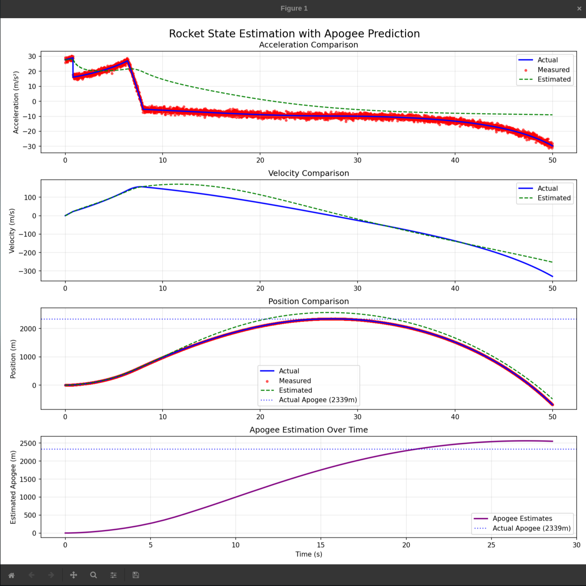
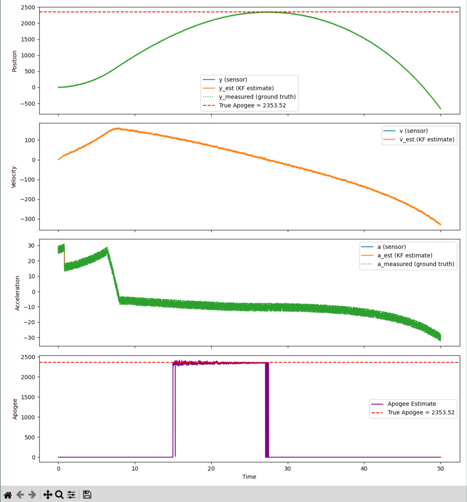

# apogee_estimation

This repo generally tracks my work to implement a system similar to what [this paper](https://www.researchgate.net/publication/385208129_Real-time_adaptive_apogee_prediction_for_a_suborbital_student_rocket) is doing.

The big differences is they have much better non linear state estimation, and handle orientation changes better in their dynamics.

## Current Approach

Right now instead of using non linear state estimators like the EKF and UKF outlined in the paper we're using a linear Kalman Filter.
The system model is pretty simplistic, using x = [x, v, a]. Having a modelled accel state is sus because we have a "analytical" model of it but its innacurate and we have acceleration measurements to take into account.
It uses a really simple A model as well, which is discretized before simulation.

Once having a state estimate we use our dynamics model to rk4 into the future, and then once v < 0 we get our apogee estimation.

The flight constants are pretty bad and we'll need a model to most likely live estimate them.

### Implementation (python)

The implementation I did in python is pretty bad and gpt assisted but it generally proved this method worked, most of the actual work was done in c++.

### Implementation (Real Hardware)

The "real hardware" I ran this on was a [WePill BlackPill STM32F401CC](https://stm32-base.org/boards/STM32F401CCU6-WeAct-Black-Pill-V1.2.html) to best match what I understand to be the actual rocket flight hardware.

I used platformio and the arduino framework, installing cmsis dsp to handle matrix multiplications.

To make my life easier I wrapped the matrix operations around a templated matrix class with operator overloads, this also means im probably leaving some mat mul performance operations on the table here.
I also wrote a kf class around the Matrix class.

I used FreeRTOS to time my loop exactly to 200Hz. My loop runs for 50s in total with a 5ms simulated dt.
For my rk4 i used a step size of 200ms, any higher and itd run for longer than 5ms.
But my processor is 16MHz slower than actual hardware so we have some headroom.

To fix the issue of prints blocking I made a queue which printed outside of the main loop so it could run at full speed.
My noise isn't really modelled properly, and because I was too lazy to implement matrix exmp in this code I just discretized A and Q in a python file beforehand.

But overall this shows that this method can work pretty well.

## Next Steps

The biggest next steps is to use non linear state estimation, which will run much better against real data.
To do this we need to implement the jacobian auto differentiation most likely to let us linearize our state around each timestep.
The nice advantage of doing this is it means we can probably reuse the linearized jacobian for any optimal control methods like an LQR.

We also need a real mass and thrust model from openrocket, as well as real drag numbers.

The big next step is checking this method against real data.
